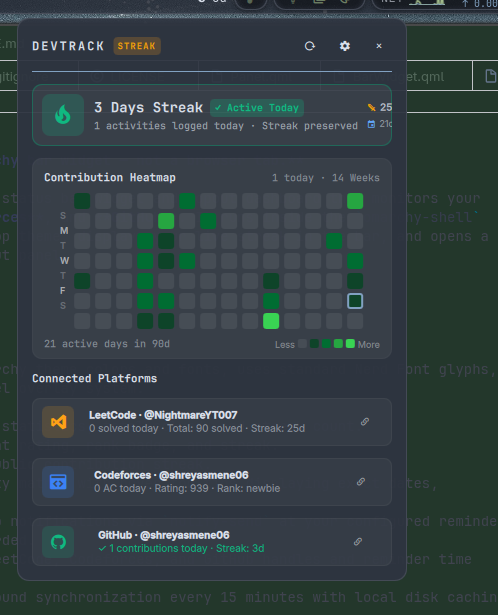

# DevTrack

**Your coding streaks and activity as a native Omarchy bar widget — not a browser tab.**

DevTrack is an Omarchy desktop plugin: a Quickshell status bar widget and popout dashboard that monitors your daily coding progress across **LeetCode**, **Codeforces**, and **GitHub**. It runs inside the `omarchy-shell` process you already have, follows your active desktop theme, displays your live streak in the bar, and opens a 14-week contribution heatmap in an interactive popout panel.

<p align="center">
  
</p>

---

## Features

- **Designed for Omarchy.** Follows your active Omarchy theme colors and fonts, uses standard Nerd Font glyphs, and integrates directly into the status bar and panel overlay system.
- **Multi-Platform Activity Tracking.**
  - **LeetCode**: Problems solved today, acceptance statistics, total solved, and streak count.
  - **Codeforces**: Accepted solutions today, current rating, rank badge, and streak.
  - **GitHub**: Daily commit/push/PR activity and public contribution streak.
- **14-Week Contribution Heatmap.** A 98-day activity matrix with hover tooltips displaying exact dates, contribution counts, and 90-day active statistics.
- **Proactive Evening Reminders.** Automated desktop notifications via `notify-send` at your configured reminder time (default `21:00`) if no activity has been recorded.
- **In-Panel Settings Interface.** Configure your LeetCode, Codeforces, and GitHub handles and reminder time directly from the popout panel header.
- **Headless Background Service.** Automatic background synchronization every 15 minutes with local disk caching in `~/.config/omarchy/devtrack/data.json`.

---

## What It Is

Two interconnected parts in one plugin:

- A **live streak indicator** in the top bar (`󰈸 2d`), which updates automatically whether or not the popout panel is open.
- An **interactive popout dashboard** with hero streak statistics, a full 14-week contribution heatmap, platform status cards with quick profile links (`󰌹`), and an in-place configuration editor.

---

## Add It to Omarchy

Install directly from the git repository:

```bash
omarchy plugin add https://github.com/shreyasmene06/DevTrack.git --enable
```

Then click the flame icon in the top bar to open the dashboard.

### Optional Keyboard Shortcut

To toggle the panel from your keyboard, add this binding to `~/.config/hypr/bindings.lua`:

```lua
o.bind("SUPER + SHIFT + D", "DevTrack", "omarchy-shell devtrack.streak toggle")
```

---

## Removal & Disabling

To temporarily disable the plugin:

```bash
omarchy plugin disable devtrack.streak
```

To re-enable it:

```bash
omarchy plugin enable devtrack.streak
```

To completely remove the plugin from Omarchy:

```bash
omarchy plugin remove devtrack.streak --yes
```

---

## Commands & IPC

You can interact with DevTrack from scripts or keybindings via `omarchy-shell`:

```bash
# Toggle the popout dashboard
omarchy-shell devtrack.streak toggle

# Open the popout dashboard
omarchy-shell devtrack.streak open

# Close the popout dashboard
omarchy-shell devtrack.streak close

# Trigger an immediate background synchronization
omarchy-shell devtrack.streak refresh
```

---

## Configuration

You can configure your usernames directly through the settings interface in the panel (click the 󰒓 settings button in the panel header) or manually by editing `~/.config/omarchy/devtrack/config.json`:

```json
{
  "platforms": {
    "leetcode": {
      "enabled": true,
      "username": "NightmareYT007"
    },
    "codeforces": {
      "enabled": true,
      "handle": "shreyasmene06"
    },
    "github": {
      "enabled": true,
      "username": "shreyasmene06"
    }
  },
  "reminder": {
    "enabled": true,
    "time": "21:00"
  },
  "general": {
    "sync_interval_minutes": 15,
    "mode": "any"
  }
}
```

---

## Requirements

- **Omarchy Quattro / Quickshell**
- **Python 3** (for background API polling and notifications)
- **libnotify / notify-send** (included in Omarchy for desktop alerts)

---

## License

This project is licensed under the [MIT License](LICENSE).
